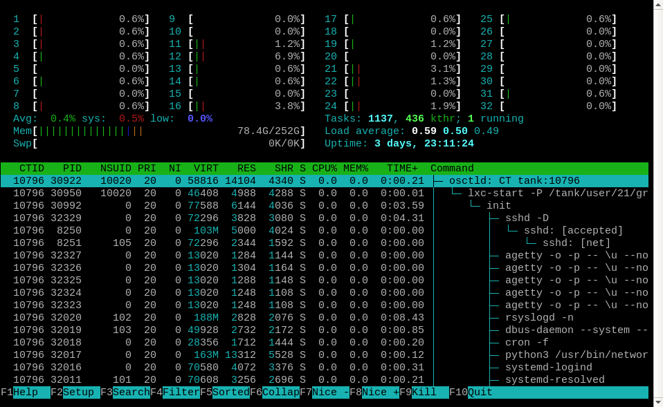

# vpsAdminOS containers

Containers created using *osctl* are actually LXC containers. *osctl* provides
an abstracted interface to control these containers, while in fact every
container can be run under a different user and within a different resource
group. It can be useful to know what is *osctld* actually doing for you and how
you can manipulate the LXC containers directly. The first step is understanding
how *osctld* uses ZFS pools.

## Pools
Let's create a pool and install it into *osctld*:

```bash
# Install a pool
dd if=/dev/zero of=/tank.zpool bs=1M count=4096
zpool create tank /tank.zpool
osctl pool install tank

# List pool layout
zfs list
NAME                 USED  AVAIL  REFER  MOUNTPOINT
tank                5.50M   874M  41.5K  /tank
tank/conf           30.5K   874M  30.5K  /tank/conf
tank/ct               24K   874M    24K  /tank/ct
tank/log              30K   874M    30K  /tank/log
tank/repository     5.03M   874M  5.03M  /tank/repository
```

Dataset `tank/conf` is used to store configuration files for users, groups,
containers, repositories and migrations in respective subdirectories.
The configuration files actually define those entities, i.e. when there is no
configuration file for a container, the container does not exist.

`tank/ct` contains subdatasets, one for every container, named by container ids.
These datasets contain the containers' rootfs and have their user/group ids
shifted into the user namespace.

`tank/log` is used to store log files generated by `lxc-start`, one for each
container.

`tank/repository` contains local caches for remote template repositories.
Whenever you create a container using a template from a remote repository,
the downloaded template is cached for later use.

Users representing user namespaces are stored in directory
`/run/osctl/pools/tank/users`. User directories contain subdirectories for every
user/group combination that any containers are using. These directories are what
LXC calls *LXC home* or *LXC path*, which by default in LXC is `/var/lib/lxc`.
In vpsAdminOS, there is one *LXC path* for every user/group combination used
by containers. Inside *LXC path* are directories representing containers,
containing config files read by LXC.

Let's create a container and see it in action:

```bash
# Create a one user namespace and a container
osctl user new --map 0:666000:65536 myuser01
osctl ct new --user myuser01 --distribution ubuntu --version 16.04 myct01

# Review pool layout
zfs list -oname,uidmap,gidmap,mountpoint
NAME                UIDMAP          GIDMAP          MOUNTPOINT
tank                none            none            /tank
tank/conf           none            none            /tank/conf
tank/ct             none            none            /tank/ct
tank/ct/myct01      0:666000:65536  0:666000:65536  /tank/ct/myct01      # Container rootfs
tank/log            none            none            /tank/log
tank/repository     none            none            /tank/repository
```

Because every user, group and container is defined by multiple datasets, files
or directories, *osctl* provides a way to see what those entities are and what
is their state. First, review the user namespace:

```console
osctl user assets myuser01
TYPE        PATH                                         STATE   PURPOSE
directory   /run/osctl/pools/tank/users/myuser01         valid   User directory
directory   /run/osctl/pools/tank/users/myuser01/.home   valid   Home directory
file        /tank/conf/user/myuser01.yml                 valid   osctld's user config
entry       /etc/passwd                                  valid   System user
entry       /etc/group                                   valid   System group
```

If `VALID` is not `true` for some asset, it means that either it does not exist
or is invalid, such as wrong file owner, group or access mode. Use option `-v`
to show these errors.

Because we haven't selected a group when creating the container, *osctld* put
it into the *default* group. Let's see its assets:

```console
group assets /default
TYPE        PATH                                                     STATE   PURPOSE
file        /tank/conf/group/default/config.yml                      valid   osctld's group config
directory   /run/osctl/pools/tank/users/myuser01/group.default/cts   valid   LXC path for myuser01:/default
```

As you can see, there is one LXC path for user `myuser01` and group `default`,
where our container resides. Let's review the container:

```bash
ct assets myct01
TYPE        PATH                                                                     STATE     PURPOSE
dataset     tank/ct/myct01                                                           valid     Container's rootfs dataset
directory   /tank/ct/myct01/private                                                  valid     Container's rootfs
directory   /tank/hook/ct/myct01                                                     valid     User supplied script hooks
directory   /run/osctl/pools/tank/users/myuser01/group.default/cts/myct01            valid     LXC configuration
file        /run/osctl/pools/tank/users/myuser01/group.default/cts/myct01/config     valid     LXC base config
file        /run/osctl/pools/tank/users/myuser01/group.default/cts/myct01/network    valid     LXC network config
file        /run/osctl/pools/tank/users/myuser01/group.default/cts/myct01/cgparams   valid     LXC cgroup parameters
file        /run/osctl/pools/tank/users/myuser01/group.default/cts/myct01/prlimits   valid     LXC resource limits
file        /run/osctl/pools/tank/users/myuser01/group.default/cts/myct01/mounts     valid     LXC mounts
file        /run/osctl/pools/tank/users/myuser01/group.default/cts/myct01/.bashrc    valid     Shell configuration file for osctl ct su
file        /tank/conf/ct/myct01.yml                                                 valid     Container config for osctld
file        /tank/log/ct/myct01.log                                                  valid     LXC log file
```

## cd helpers
Whenever you need to manage a container from the host, you might want to `cd`
into the container's directory. *osctl* has helpers for that:

 - `osctl ct cd <id>` for the container's rootfs
 - `osctl ct cd -l | --lxc <id>` for the container's LXC configuration directory
 - `osctl ct cd -r | --runtime <id>` for the mounted rootfs, available only
   when the container is running.

A new shell with a modified prompt is spawned. Simply exit the shell to return
to your previous session.

## Attaching containers
Administrators can use `osctl ct attach` to enter containers and get root shell,
without the need of knowing password for SSH or `osctl ct console`. *osctl*
is by default trying to unify the shell interface from the administrator's
point of view, so that whatever container you enter, you always get the same
prompt and behaviour.

```bash
ct attach myct01
[CT myct01] root@myct01:/# cat /etc/alpine-release
3.7.0

ct attach myct02
[CT myct02] root@myct02:/# lsb_release -a
No LSB modules are available.
Distributor ID: Ubuntu
Description:    Ubuntu 18.04 LTS
Release:        18.04
Codename:       bionic
```

This is done by ignoring shell configuration from the container and configuring
the shell from the host. If you wish to open the shell and load configuration
from the container, you can use option `-u, --user-shell`.

## Identifying container processes from the host
When you find a misbehaving process on the host, you need to identify to which
container the process belongs to, so that you may notify its owner or set
a limit. You could do this manually by looking at `/proc/<pid>/cgroup` and
identifying the container by the cgroup path. This is what `osctl ct pid` does.
You give it process IDs as seen on the host and it will tell you what containers
they belong to.

```bash
osctl ct pid 22690 23292
PID        CONTAINER            CTPID      NAME
22690      tank:myct01          226        agetty
23292      tank:myct01          228        agetty
```

*osctl* can also read process IDs from standard input:

```bash
osctl ct pid -
PID        CONTAINER            CTPID      NAME
> 22690
22690      tank:myct01          226        agetty
> 23292
23292      tank:myct01          228        agetty
```

## Listing container processes
*osctl* provides a way of filtering processes that belong to a particular
container without entering the container:

```bash
osctl ct ps myct01
   PID  CTPID    CTEUID   VMSIZE    RSS  STATE   START    TIME  COMMAND
 10140  1             0    75.4M   1.6K  S       11:07      0s  /sbin/init
 10272  53            0    76.6M   2.0K  S       11:07      0s  /lib/systemd/systemd-journald
 10283  62            0    41.1M    621  S       11:07      0s  /lib/systemd/systemd-udevd
 10342  120         101    69.0M    880  S       11:07      0s  /lib/systemd/systemd-resolved
 10343  121           0    60.6M    982  S       11:07      0s  /lib/systemd/systemd-logind
 10344  122           0    29.3M    475  S       11:07      0s  /usr/sbin/cron-f
 10345  123           0   165.2M   3.3K  S       11:07      0s  /usr/bin/python3/usr/bin/networkd-dispatcher--run-startup-triggers
 10346  124         103    48.8M    674  S       11:07      0s  /usr/bin/dbus-daemon--system--address=systemd:--nofork--nopidfile--systemd-activation--syslog-only
 10347  125         102   188.9M    681  S       11:07      0s  /usr/sbin/rsyslogd-n
 10354  132           0    14.3M    350  S       11:07      0s  /sbin/agetty-o-p -- \u--noclear--keep-baudconsole115200,38400,9600vt220
 10355  133           0    14.3M    341  S       11:07      0s  /sbin/agetty-o-p -- \u--noclear--keep-baudpts/3115200,38400,9600vt220
 10356  134           0    14.3M    344  S       11:07      0s  /sbin/agetty-o-p -- \u--noclear--keep-baudpts/2115200,38400,9600vt220
 10357  135           0    14.3M    347  S       11:07      0s  /sbin/agetty-o-p -- \u--noclear--keep-baudpts/0115200,38400,9600vt220
 10358  136           0    14.3M    345  S       11:07      0s  /sbin/agetty-o-p -- \u--noclear--keep-baudpts/1115200,38400,9600vt220
 10359  137           0    70.6M    917  S       11:07      0s  /usr/sbin/sshd-D
```

## Container resource monitor
`osctl ct top` is a top-like TUI application that monitors real-time resource
usage. Instead of processes it monitors containers.


It can work in two modes: real-time and cumulative. Real-time shows resource
consumption since the last update, i.e. 1 second by default. Cumulative shows
resource usage since the program was started. Mode can be switched by pressing
`m`.

Left and right arrows can be used to change the sort column, `r` to reverse
sort order. Up and down arrows move selection cursor up and down, spacebar will
highlight selected container for easier spotting. Enter/return key will open
*htop* focused on the selected container, see below. Press `?` to show all key
bindings.

## Process monitor
*htop* in vpsAdminOS is patched to be able to identify to which containers
processes belong. It has four extra columns: `POOL`, `CTID`, `NSPID` and `NSUID`.
For container processes, `NSPID` shows the process ID and `NSUID` the process
user ID as it is seen inside the container, i.e. its user namespace.



Our *htop* can filter processes by container ID. You can use CLI option
`-c`, `--container` to select which container to filter at start, e.g.:
`htop -c tank:10796`. Filters can also be changed at runtime, press `n`
and select a container, the host, or all processes.

## Log file
You don't need to remember the path to a container's log file, because *osctl*
can either dump it for you or just print the path:

```bash
osctl ct log cat <id>
osctl ct log path <id>
```

When debugging a container that's failing to start, you can enable LXC debug
messages using `osctl ct start --debug`.

## Reloading config file
Container config files are meant to be edited through *osctl*. *osctld* reads
all config files on start and does not check them for changes after that. If
you've manually edited some container config, you can tell *osctld* to reload
it:

```bash
osctl ct cfg reload <id>
```

Note that the container has to be stopped for the reload to be allowed.

## User shell
Should you want to switch to a container's user and use LXC utilities directly,
you have to use `osctl ct su <id>`. Using `/bin/su` is insufficient, because standard
`su` does not manage cgroups. `osctl ct su` will open a shell with the same
environment as *osctld* itself is using to start the container.

```bash
osctl ct su myct01
Opened shell for:
  User:  myuser01
  Group: /default
  CT:    myct01

Available LXC utilities:
  lxc-attach
  lxc-cgroup
  lxc-console
  lxc-device
  lxc-execute
  lxc-info
  lxc-ls
  lxc-monitor
  lxc-stop
  lxc-top
  lxc-wait

Implicit arguments: -P /run/osctl/pools/tank/users/myuser01/default -n myct01
Do not use this shell to manipulate any other container than myct01.

[unsmyuser01@vpsadminos:/run/osctl/pools/tank/users/myuser01/group.default/cts]$ 
```

The shell uses `/run/osctl/pools/tank/users/myuser01/group.default/cts/myct01/.bashrc`
instead of `~/.bashrc`, see user assets above. The shell can be used to manipulate
only the chosen container, because every container has a specific cgroup path,
so running other containers would put them to a wrong group.

The LXC utilities are unmodified except for the implicit arguments, which let
you forget that there is a non-default LXC path and some container id.
