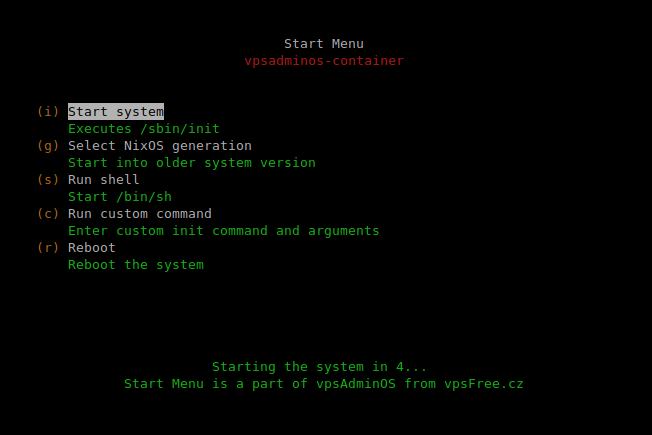

# Start Menu
Start Menu is a program from vpsAdminOS which is run in containers before the
init system. It is an alternative to a bootloader, allowing the user to customize
container start if needed. The menu can be seen in the console attached by
`osctl ct console`. By default, the start menu waits 5 seconds before starting
the init system.



## Menu items

 - **Start system** will start the container's init system as usual.
 - **Select NixOS generation** appears only in containers running NixOS. The user
   can choose the system generation to be started.
 - **Run shell** will start `/bin/sh` from the container. After the shell is
   closed, the start menu reappears. This can be used to access the file system
   when the system is not starting, e.g. due to a configuration error.
 - **Run custom command** can be used to add arguments to the init process
   or to run a different process as init.

## Configuration
The Start Menu is enabled by default. It can be configured per-container using
`osctl ct set/unset start-menu` commands.

To increase the timeout to 30 seconds, use:

```bash
osctl ct set start-menu -t 30 myct01
```

To disable the menu altogether, run:

```bash
osctl ct unset start-menu myct01
```
